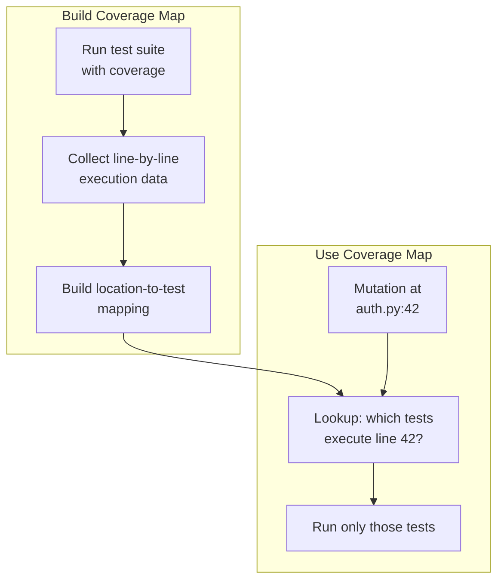

# Coverage-Guided Test Selection

Coverage-guided test selection is the second pillar of pytest-gremlins' speed architecture.
By running only the tests that can possibly detect a mutation, we achieve a 10-100x reduction
in test executions.

## The Problem: Too Many Test Runs

Consider a project with:

- 1,000 mutation points
- 500 tests

Naive mutation testing runs every test against every mutation:

```text
1,000 mutations x 500 tests = 500,000 test executions
```

If each test takes 10ms, that is 83 minutes of CPU time - and that is before counting test setup/teardown overhead.

But here is the insight: **most test-mutation combinations are pointless**. A test for the
login module cannot possibly detect a mutation in the shipping calculator. Running it is
pure waste.

## The Solution: Run Only Relevant Tests

Coverage-guided test selection builds a map from code locations to tests, then uses that map
to run only tests that actually execute the mutated code.



## How It Works

### Step 1: Collect Coverage Data

pytest-gremlins uses pytest-cov (or coverage.py directly) to collect line-level coverage data:

```bash
# pytest-gremlins runs this automatically during the first phase
pytest --cov=src --cov-report=json
```

This produces coverage data showing which tests executed which lines:

```json
{
  "src/auth.py": {
    "executed_lines": [1, 2, 5, 10, 42, 43, 44],
    "missing_lines": [15, 16, 17]
  }
}
```

### Step 2: Build the Test-to-Line Map

During coverage collection, we also track which test was running when each line was executed:

```python
coverage_map = {
    "src/auth.py:42": {"test_login_success", "test_login_failure"},
    "src/auth.py:43": {"test_login_success", "test_login_failure"},
    "src/shipping.py:17": {"test_calculate_shipping"},
    "src/shipping.py:18": {"test_calculate_shipping", "test_free_shipping"},
}
```

### Step 3: Select Tests for Each Mutation

When we need to test a mutation at `src/auth.py:42`, we look up the map:

```python
def get_tests_for_mutation(file: str, line: int) -> set[str]:
    key = f"{file}:{line}"
    return coverage_map.get(key, set())

# For mutation at auth.py:42
tests = get_tests_for_mutation("src/auth.py", 42)
# Returns: {"test_login_success", "test_login_failure"}
```

Instead of running 500 tests, we run 2.

### The Math

| Scenario | Test Runs |
|----------|-----------|
| Naive (all tests x all mutations) | 500,000 |
| Coverage-guided (avg 5 tests per mutation) | 5,000 |
| **Reduction** | **100x** |

In practice, the reduction depends on codebase modularity:

- **Highly modular code:** Each mutation might have 1-3 covering tests (100x+ reduction)
- **Tightly coupled code:** Mutations might have 50+ covering tests (10x reduction)
- **Integration-heavy tests:** Tests might cover many lines (smaller reduction)

## Implementation Details

### Coverage Data Format

pytest-gremlins stores coverage data in an efficient format:

```python
@dataclass
class CoverageMap:
    # file -> line -> set of test IDs
    data: dict[str, dict[int, set[str]]]

    def tests_for_line(self, file: str, line: int) -> set[str]:
        return self.data.get(file, {}).get(line, set())

    def tests_for_range(self, file: str, start: int, end: int) -> set[str]:
        """Get tests covering any line in a range (for multi-line mutations)."""
        tests = set()
        for line in range(start, end + 1):
            tests.update(self.tests_for_line(file, line))
        return tests
```

### Handling Multi-Line Mutations

Some mutations span multiple lines. We take the union of tests covering all affected lines:

```python
# Original code spanning lines 42-44
def validate_age(age):
    if age >= 18:     # line 42
        return True   # line 43
    return False      # line 44

# Mutation affects the entire function
affected_lines = range(42, 45)
covering_tests = coverage_map.tests_for_range("validators.py", 42, 44)
```

### Branch Coverage

Line coverage can miss mutations in conditional branches:

```python
def process(x):
    if x > 0:         # line 10 - covered
        return x * 2  # line 11 - maybe not covered if x is always > 0
    return x          # line 12 - maybe not covered
```

pytest-gremlins uses branch coverage when available to improve test selection accuracy:

```python
# With branch coverage, we know:
# - Branch "x > 0 == True" covered by: test_positive
# - Branch "x > 0 == False" covered by: test_negative

# A mutation to line 11 should only run test_positive
# A mutation to line 12 should only run test_negative
```

## Configuration

### Enabling Coverage Guidance

Coverage guidance is enabled by default. Disable it if needed:

```toml
[tool.pytest-gremlins]
coverage_guidance = true  # default
```

### Pre-existing Coverage Data

If you already have coverage data from CI, pytest-gremlins can use it:

```bash
# Use existing coverage.json
pytest --gremlins --coverage-data=coverage.json
```

### Coverage Collection Options

```toml
[tool.pytest-gremlins]
# Include branch coverage (more accurate but slower to collect)
coverage_branch = true

# Minimum number of tests before coverage guidance kicks in
# (for very small test suites, the overhead is not worth it)
coverage_threshold = 10
```

## Edge Cases

### Tests with No Coverage Data

If a test cannot be mapped to coverage data (perhaps it was added after coverage collection), pytest-gremlins treats it conservatively:

```python
# If we cannot determine coverage, assume the test might cover anything
if test not in coverage_data:
    return ALL_TESTS  # Conservative: run everything
```

### Mutations in Uncovered Code

Code that no test covers will have no covering tests:

```python
tests = coverage_map.tests_for_line("src/legacy.py", 100)
# Returns: set()  # Empty - no tests cover this line
```

These mutations are marked as **automatically surviving** - they indicate a coverage gap.

### Dynamic Code Execution

Some code paths are only executed dynamically:

```python
def handler(event_type):
    handlers = {
        "click": handle_click,
        "hover": handle_hover,
    }
    return handlers[event_type]()  # Which handler runs depends on input
```

pytest-gremlins tracks the actual runtime coverage, so if `test_click` only calls
`handle_click`, mutations in `handle_hover` will not trigger that test.

## Debugging Coverage Issues

### Why did my test not run?

```bash
# Show which tests cover a specific line
pytest --gremlins --show-coverage src/auth.py:42
```

Output:

```text
Line src/auth.py:42 is covered by:
  - tests/test_auth.py::test_login_success
  - tests/test_auth.py::test_login_failure
```

### Why did a mutation survive?

If a mutation survives unexpectedly, check coverage:

```bash
# Show coverage report for a surviving gremlin
pytest --gremlins --explain-survivor g_auth_42_comparison
```

Output:

```text
Gremlin g_auth_42_comparison (src/auth.py:42)
  Mutation: >= to >
  Covering tests: test_login_success, test_login_failure
  Test results:
    - test_login_success: PASSED (did not detect mutation)
    - test_login_failure: PASSED (did not detect mutation)

Suggestion: Add a test that verifies the boundary condition (age == 18)
```

### Refreshing Coverage Data

Coverage data can become stale. Refresh it:

```bash
# Force coverage recollection
pytest --gremlins --refresh-coverage
```

## Performance Characteristics

### Coverage Collection Overhead

Collecting coverage data adds overhead to test runs:

| Configuration | Overhead |
|---------------|----------|
| Line coverage | 5-15% slower |
| Branch coverage | 10-25% slower |

This is a one-time cost. Subsequent gremlin runs use cached coverage data.

### Memory Usage

The coverage map is stored in memory. For large projects:

| Lines of Code | Tests | Map Size |
|---------------|-------|----------|
| 10,000 | 500 | ~5 MB |
| 100,000 | 5,000 | ~50 MB |
| 1,000,000 | 50,000 | ~500 MB |

For very large projects, coverage data can be stored on disk and loaded on demand.

### Lookup Performance

Coverage lookups are O(1) hash table operations - essentially instant compared to running a test.

## Inspiration and Prior Art

Coverage-guided mutation testing is standard practice in mature tools:

**PIT (Java):**
> "PIT only runs the tests relevant to each mutation. This typically reduces the number of tests run by 90-99%."

**Stryker (JavaScript):**
> "Coverage analysis gives us an additional 40-60% speedup by skipping tests that cannot detect mutations."

pytest-gremlins brings these same benefits to Python.

## Summary

Coverage-guided test selection delivers 10-100x speedup by eliminating pointless test runs:

1. **Collect coverage data** showing which tests execute which lines
2. **Build a map** from code locations to covering tests
3. **Run only relevant tests** for each mutation

Combined with mutation switching, incremental analysis, and parallel execution, coverage
guidance makes mutation testing practical for everyday development.
