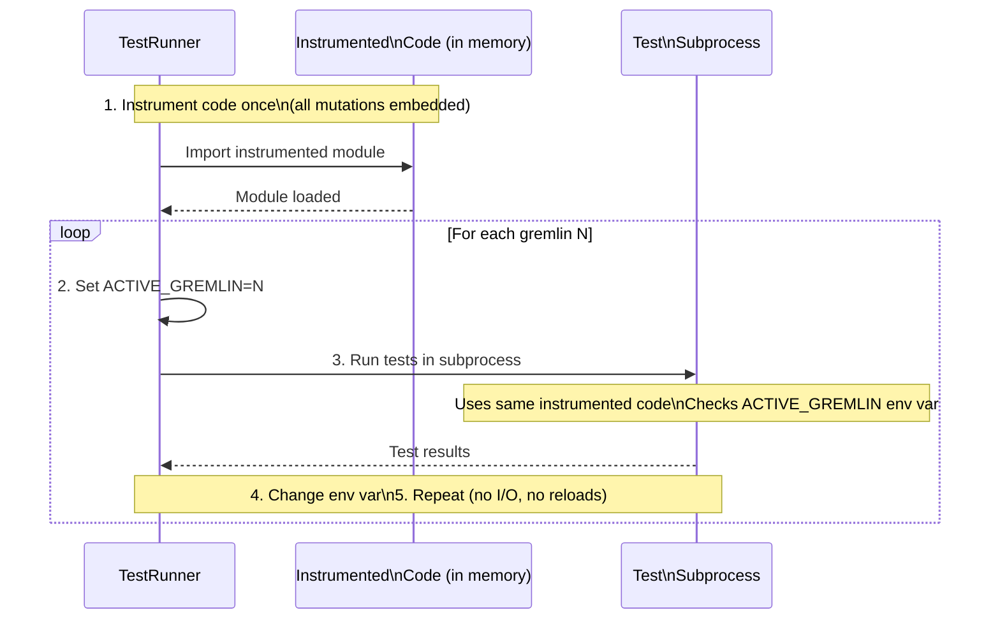

# pytest-gremlins internals – per‑gremlin execution loop

```mermaid
sequenceDiagram
    participant TestRunner
    participant InstrumentedCode as Instrumented\nCode (in memory)
    participant TestProcess as Test\nSubprocess

    Note over TestRunner,InstrumentedCode: 1. Instrument code once\n(all mutations embedded)
    TestRunner->>InstrumentedCode: Import instrumented module
    InstrumentedCode-->>TestRunner: Module loaded

    loop For each gremlin N
        TestRunner->>TestRunner: 2. Set ACTIVE_GREMLIN=N
        TestRunner->>TestProcess: 3. Run tests in subprocess
        Note over TestProcess: Uses same instrumented code\nChecks ACTIVE_GREMLIN env var
        TestProcess-->>TestRunner: Test results
        Note over TestRunner,TestProcess: 4. Change env var\n5. Repeat (no I/O, no reloads)
    end
```