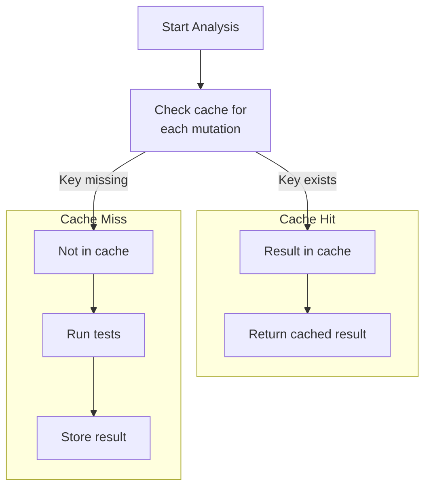

# Incremental Analysis

Incremental analysis is the third pillar of pytest-gremlins' speed architecture. By caching
results and only re-analyzing what actually changed, repeat runs complete in seconds instead
of minutes.

## The Problem: Slow Feedback Loops

Imagine this workflow:

1. Run mutation testing: **10 minutes**
2. Find a survivor in `auth.py`
3. Add a test to catch it
4. Run mutation testing again: **10 minutes**

Twenty minutes to verify one test improvement. This is not a feedback loop - it is a feedback crawl.

Worse, most of that time is wasted. You only changed one test file, but naive mutation testing re-analyzes everything.

## The Solution: Cache Everything

Incremental analysis caches mutation results and only re-runs analysis when something changes:



## How Cache Keys Work

The cache key for a mutation result includes everything that could affect the outcome:

```python
cache_key = hash(
    source_file_content +      # The code being mutated
    mutation_definition +      # What mutation is applied
    test_file_contents +       # Tests that cover this mutation
    pytest_gremlins_version    # Tool version (for format changes)
)
```

If any of these change, the cache is invalidated for that mutation.

### Example

```python
# Cache key for mutation g_auth_42_comparison:
key = hash(
    file_hash("src/auth.py"),           # abc123
    "comparison:>=:>:line42:col8",       # mutation details
    file_hash("tests/test_auth.py"),     # def456
    "0.1.0"                               # version
)
# Result: "abc123_def456_comparison_42_8_gt_0.1.0"
```

## Cache Invalidation Rules

The cache is smart about what needs re-analysis:

| What Changed | What Gets Invalidated |
|--------------|----------------------|
| Source file modified | All mutations in that file |
| Test file modified | Mutations covered by those tests |
| New test added | Mutations the new test covers |
| Test deleted | Mutations that test was covering |
| pytest-gremlins upgraded | Everything (version mismatch) |
| Nothing changed | Nothing (instant results) |

### Source File Changed

When `src/auth.py` changes:

```python
# Old content hash: abc123
# New content hash: xyz789

# All mutations in auth.py are invalidated
invalidated = [m for m in mutations if m.file == "src/auth.py"]
```

### Test File Changed

When `tests/test_auth.py` changes:

```python
# Find mutations covered by tests in this file
tests_in_file = get_tests("tests/test_auth.py")
# ["test_login_success", "test_login_failure"]

# Find mutations those tests cover
invalidated = [
    m for m in mutations
    if m.covering_tests & tests_in_file
]
```

### Nothing Changed

```python
# Compare file hashes
if all_hashes_match(previous_run):
    # Return cached results immediately
    return load_cache()
```

This is the common case during development. You run gremlins, see results, think about them, run again - instant feedback.

## Cache Storage

### Cache Location

By default, pytest-gremlins stores the cache in your project:

```text
.gremlins_cache/
  metadata.json        # Version, timestamps
  coverage_map.json    # Coverage data
  results/
    abc123.json        # Results keyed by hash
    def456.json
    ...
```

### Cache Format

Each cached result contains:

```json
{
  "key": "abc123_def456_comparison_42_8_gt_0.1.0",
  "mutation": {
    "id": "g_auth_42_comparison_gt",
    "file": "src/auth.py",
    "line": 42,
    "operator": "comparison",
    "original": ">=",
    "mutated": ">"
  },
  "result": "killed",
  "killed_by": "tests/test_auth.py::test_boundary_age",
  "execution_time_ms": 23,
  "timestamp": "2024-01-15T10:30:00Z"
}
```

### Cache Size

The cache is compact:

| Project Size | Mutations | Cache Size |
|-------------|-----------|------------|
| Small (1K LOC) | 100 | ~100 KB |
| Medium (10K LOC) | 1,000 | ~1 MB |
| Large (100K LOC) | 10,000 | ~10 MB |

Storage is cheap; re-running analysis is expensive.

## Configuration

### Cache Location

```toml
[tool.pytest-gremlins]
cache_dir = ".gremlins_cache"  # default
```

Or use an environment variable:

```bash
export PYTEST_GREMLINS_CACHE_DIR="/tmp/gremlins_cache"
```

### Disabling Cache

For CI or when you want fresh results:

```bash
# Ignore cache, run fresh analysis
pytest --gremlins --no-cache

# Clear cache, then run
pytest --gremlins --clear-cache
```

### Cache Sharing

For teams, the cache can be shared via CI artifacts:

```yaml
# .github/workflows/gremlins.yml
- name: Restore gremlins cache
  uses: actions/cache@v3
  with:
    path: .gremlins_cache
    key: gremlins-${{ hashFiles('src/**/*.py', 'tests/**/*.py') }}
    restore-keys: |
      gremlins-

- name: Run mutation testing
  run: pytest --gremlins

- name: Save gremlins cache
  uses: actions/cache@v3
  with:
    path: .gremlins_cache
    key: gremlins-${{ hashFiles('src/**/*.py', 'tests/**/*.py') }}
```

## Performance Characteristics

### First Run

The first run has no cache benefit - everything must be analyzed:

```text
First run: 5 minutes (1,000 mutations, no cache)
```

### Repeat Run (Nothing Changed)

If nothing changed, results are instant:

```text
Repeat run: < 5 seconds (cache validation only)
```

### Partial Change

Changing one source file invalidates only its mutations:

```text
Changed src/auth.py (100 mutations out of 1,000)
Re-analyzed: 100 mutations (10% of total)
Time: 30 seconds
```

### Optimal Workflow

The cache makes this workflow practical:

1. **Full run:** 5 minutes (first time or nightly CI)
2. **Work on auth.py:** Make changes
3. **Incremental run:** 30 seconds (only auth.py mutations)
4. **Fix test_auth.py:** Add better tests
5. **Incremental run:** 20 seconds (only mutations covered by changed tests)
6. **No changes:** < 5 seconds (everything cached)

## Cache Integrity

### Corruption Detection

Each cache entry includes a checksum:

```python
entry = {
    "data": {...},
    "checksum": sha256(json.dumps(data))
}

# On load
if sha256(entry["data"]) != entry["checksum"]:
    log.warning("Cache corruption detected, invalidating entry")
    delete_entry(key)
```

### Version Compatibility

Cache entries include the pytest-gremlins version:

```python
if entry["version"] != current_version:
    log.info("Version mismatch, invalidating cache")
    clear_cache()
```

Minor version bumps (0.1.0 -> 0.1.1) preserve cache compatibility. Major changes (0.1.0 -> 0.2.0) clear the cache.

## Debugging Cache Behavior

### Cache Status

```bash
# Show cache statistics
pytest --gremlins --cache-stats
```

Output:

```text
Cache Statistics:
  Location: .gremlins_cache
  Total entries: 1,234
  Cache size: 1.2 MB
  Hit rate: 87%
  Last full run: 2024-01-15 10:30:00

By file:
  src/auth.py: 150 entries (all valid)
  src/shipping.py: 200 entries (50 invalidated)
  src/utils.py: 100 entries (all valid)
```

### Why Was Something Re-Analyzed?

```bash
# Show why a mutation was not cached
pytest --gremlins --explain-cache g_auth_42_comparison
```

Output:

```text
Mutation g_auth_42_comparison cache status: MISS

Reason: source file changed
  Previous hash: abc123
  Current hash: xyz789
  Changed lines: 40-45

Will re-analyze with tests:
  - test_login_success
  - test_login_failure
```

### Force Re-Analysis

```bash
# Re-analyze specific files even if cached
pytest --gremlins --reanalyze src/auth.py

# Re-analyze mutations for a specific test
pytest --gremlins --reanalyze-tests tests/test_auth.py
```

## Trade-offs

### Stale Results Risk

If cache invalidation has bugs, results could be stale. Mitigations:

- Conservative invalidation (when in doubt, re-analyze)
- Version-based cache clearing
- `--no-cache` flag for verification

### Disk Space

The cache uses disk space. For most projects, this is negligible (< 10 MB). For very large projects, configure a size limit:

```toml
[tool.pytest-gremlins]
cache_max_size_mb = 100  # Evict oldest entries when exceeded
```

### Cache Warming

The first run (or after cache clear) is slow. For CI, consider:

```bash
# Nightly: full analysis, cache warm
pytest --gremlins --full

# PR checks: use warmed cache
pytest --gremlins --incremental
```

## Inspiration and Prior Art

Incremental mutation analysis is proven technology:

**PIT (Java):**

> "PIT can complete analysis of a large codebase in under 3 minutes after an initial
> 31-hour run, by remembering which mutations have been killed by which tests."

**Stryker (JavaScript):**
> "Incremental mode remembers the results from the previous run and only runs the mutants that might have a different outcome."

pytest-gremlins brings these same benefits to Python.

## Summary

Incremental analysis transforms mutation testing from a batch job into an interactive tool:

1. **Cache results** keyed by content hashes
2. **Invalidate smartly** when source or tests change
3. **Return instantly** when nothing changed

The result: seconds for repeat runs, not minutes. Fast enough for TDD.
