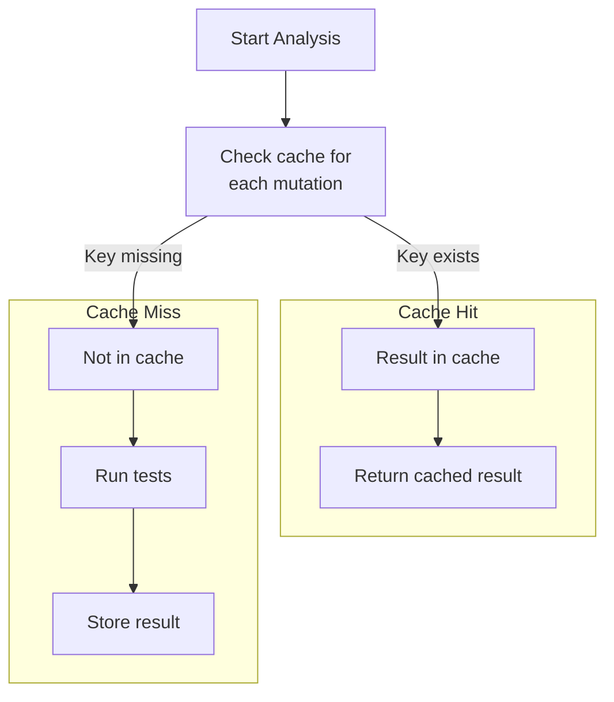

# Incremental Analysis

Incremental analysis is the third pillar of pytest-gremlins' speed architecture. By caching
results and only re-analyzing what actually changed, repeat runs complete in seconds instead
of minutes.

## The Problem: Slow Feedback Loops

Imagine this workflow:

1. Run mutation testing: **10 minutes**
2. Find a survivor in `auth.py`
3. Add a test to catch it
4. Run mutation testing again: **10 minutes**

Twenty minutes to verify one test improvement. This is not a feedback loop - it is a feedback crawl.

Worse, most of that time is wasted. You only changed one test file, but naive mutation testing re-analyzes everything.

## The Solution: Cache Everything

Incremental analysis caches mutation results and only re-runs analysis when something changes:


```mermaid
flowchart TB
    START["Start Analysis"]
    CHECK["Check cache for<br/>each mutation"]

    subgraph "Cache Hit"
        HIT["Result in cache"]
        RETURN["Return cached result"]
    end

    subgraph "Cache Miss"
        MISS["Not in cache"]
        RUN["Run tests"]
        STORE["Store result"]
    end

    START --> CHECK
    CHECK -->|"Key exists"| HIT --> RETURN
    CHECK -->|"Key missing"| MISS --> RUN --> STORE
```

## How Cache Keys Work

The cache key for a mutation result includes everything that could affect the outcome:

```python
cache_key = hash(
    source_file_content +      # The code being mutated
    mutation_definition +      # What mutation is applied
    test_file_contents +       # Tests that cover this mutation
    pytest_gremlins_version    # Tool version (for format changes)
)
```

If any of these change, the cache is invalidated for that mutation.

### Example

```python
# Cache key for mutation g_auth_42_comparison:
key = hash(
    file_hash("src/auth.py"),           # abc123
    "comparison:>=:>:line42:col8",       # mutation details
    file_hash("tests/test_auth.py"),     # def456
    "0.1.0"                               # version
)
# Result: "abc123_def456_comparison_42_8_gt_0.1.0"
```

## Cache Invalidation Rules

The cache is smart about what needs re-analysis:

| What Changed | What Gets Invalidated |
|--------------|----------------------|
| Source file modified | All mutations in that file |
| Test file modified | Mutations covered by those tests |
| New test added | Mutations the new test covers |
| Test deleted | Mutations that test was covering |
| pytest-gremlins upgraded | Everything (version mismatch) |
| Nothing changed | Nothing (instant results) |

### Source File Changed

When `src/auth.py` changes:

```python
# Old content hash: abc123
# New content hash: xyz789

# All mutations in auth.py are invalidated
invalidated = [m for m in mutations if m.file == "src/auth.py"]
```

### Test File Changed

When `tests/test_auth.py` changes:

```python
# Find mutations covered by tests in this file
tests_in_file = get_tests("tests/test_auth.py")
# ["test_login_success", "test_login_failure"]

# Find mutations those tests cover
invalidated = [
    m for m in mutations
    if m.covering_tests & tests_in_file
]
```

### Nothing Changed

```python
# Compare file hashes
if all_hashes_match(previous_run):
    # Return cached results immediately
    return load_cache()
```

This is the common case during development. You run gremlins, see results, think about them, run again - instant feedback.

## Cache Storage

### Cache Location

By default, pytest-gremlins stores the cache in your project:

```text
.gremlins_cache/
  results.db           # SQLite database of cached gremlin results
```

### Cache Format

Results are stored in a SQLite database (`results.db`). Each row records
the cache key (built from gremlin ID, source hash, and test hashes) along
with the gremlin's outcome (zapped, survived, timeout, or error).

### Cache Size

The cache is compact:

| Project Size | Mutations | Cache Size |
|-------------|-----------|------------|
| Small (1K LOC) | 100 | ~100 KB |
| Medium (10K LOC) | 1,000 | ~1 MB |
| Large (100K LOC) | 10,000 | ~10 MB |

Storage is cheap; re-running analysis is expensive.

## Configuration

### Enabling Cache

Pass `--gremlin-cache` on the command line, or set `cache = true` in `pyproject.toml`:

```toml
[tool.pytest-gremlins]
cache = true
```

### Clearing Cache

To discard all cached results and start fresh:

```bash
pytest --gremlins --gremlin-clear-cache
```

### Cache Sharing

The cache can be shared across CI jobs using the CI platform's caching mechanism. See
[CI/CD Integration](../cookbook/ci-integration.md) for full configurations.

The pattern on every platform is:

1. Restore `.gremlins_cache/` before the mutation run
2. Run mutation testing with `--gremlin-cache`
3. Save `.gremlins_cache/` after the run — even if the threshold check failed

```yaml
# .github/workflows/gremlins.yml
- name: Restore gremlins cache
  uses: actions/cache/restore@v4
  with:
    path: .gremlins_cache
    key: ${{ runner.os }}-gremlins-${{ hashFiles('src/**/*.py', 'tests/**/*.py', 'pyproject.toml') }}
    restore-keys: |
      ${{ runner.os }}-gremlins-

- name: Run mutation testing
  run: pytest --gremlins --gremlin-cache --gremlin-report=html

- name: Save gremlins cache
  uses: actions/cache/save@v4
  if: always()   # Save even if threshold check fails
  with:
    path: .gremlins_cache
    key: ${{ runner.os }}-gremlins-${{ hashFiles('src/**/*.py', 'tests/**/*.py', 'pyproject.toml') }}
```

Note: Use `actions/cache/restore` and `actions/cache/save` separately (not the combined
`actions/cache`). The combined action cannot have `if: always()` applied to the save step
independently — it either saves on success or not at all.

### How CI Caching Interacts with IncrementalCache

The CI platform cache and IncrementalCache do different jobs:

- **CI platform cache (outer):** moves `.gremlins_cache/` onto the runner's disk before the job starts
- **IncrementalCache (inner):** reads that directory and decides which gremlins to skip

When you change one file, the outer cache key changes (it hashes all source files), so the exact
key misses. `restore-keys` falls back to the previous warm cache. The full `.gremlins_cache/`
directory lands on disk, IncrementalCache finds cache hits for every unchanged file, and only the
changed file's gremlins actually run.

Without the outer cache, IncrementalCache starts empty on every CI job — all gremlins run every
time. Without IncrementalCache, the outer cache is all-or-nothing: one changed file forces a full
re-run. They need each other.

**Why content hashes instead of commit SHAs:** a commit SHA changes on every push, even when no
Python file changed. With a SHA-keyed cache, every commit starts cold. With a content hash, two
commits that touch only documentation or CI config share the same warm cache.

## Performance Characteristics

### First Run

The first run has no cache benefit - everything must be analyzed:

```text
First run: 5 minutes (1,000 mutations, no cache)
```

### Repeat Run (Nothing Changed)

If nothing changed, results are instant:

```text
Repeat run: < 5 seconds (cache validation only)
```

### Partial Change

Changing one source file invalidates only its mutations:

```text
Changed src/auth.py (100 mutations out of 1,000)
Re-analyzed: 100 mutations (10% of total)
Time: 30 seconds
```

### Optimal Workflow

The cache makes this workflow practical:

1. **Full run:** 5 minutes (first time or nightly CI)
2. **Work on auth.py:** Make changes
3. **Incremental run:** 30 seconds (only auth.py mutations)
4. **Fix test_auth.py:** Add better tests
5. **Incremental run:** 20 seconds (only mutations covered by changed tests)
6. **No changes:** < 5 seconds (everything cached)

## Cache Integrity

### Corruption Detection

Each cache entry includes a checksum:

```python
entry = {
    "data": {...},
    "checksum": sha256(json.dumps(data))
}

# On load
if sha256(entry["data"]) != entry["checksum"]:
    log.warning("Cache corruption detected, invalidating entry")
    delete_entry(key)
```

### Version Compatibility

Cache entries include the pytest-gremlins version:

```python
if entry["version"] != current_version:
    log.info("Version mismatch, invalidating cache")
    clear_cache()
```

Minor version bumps (0.1.0 -> 0.1.1) preserve cache compatibility. Major changes (0.1.0 -> 0.2.0) clear the cache.

## Debugging Cache Behavior

To force a clean re-analysis, clear the cache before running:

```bash
pytest --gremlins --gremlin-clear-cache --gremlin-cache
```

The cache directory (`.gremlins_cache/`) can also be deleted manually.

<!-- TODO: verify whether --cache-stats, --explain-cache, --reanalyze flags are planned -->

## Trade-offs

### Stale Results Risk

If cache invalidation has bugs, results could be stale. Mitigations:

- Conservative invalidation (when in doubt, re-analyze)
- Version-based cache clearing
- `--gremlin-clear-cache` flag for verification

### Disk Space

The cache uses disk space. For most projects, this is negligible (< 10 MB). The
`.gremlins_cache/` directory can be deleted at any time to reclaim space.

### Cache Warming

The first run (or after cache clear) is slow. For CI, consider running a full
analysis nightly and using the warmed cache for PR checks:

```bash
# Nightly: full analysis, populates cache
pytest --gremlins --gremlin-cache

# PR checks: reuses warmed cache, only re-tests changed files
pytest --gremlins --gremlin-cache
```

## Inspiration and Prior Art

Incremental mutation analysis is proven technology:

**PIT (Java):**

> "PIT can complete analysis of a large codebase in under 3 minutes after an initial
> 31-hour run, by remembering which mutations have been killed by which tests."

**Stryker (JavaScript):**
> "Incremental mode remembers the results from the previous run and only runs the mutants that might have a different outcome."

pytest-gremlins brings these same benefits to Python.

## Summary

Incremental analysis transforms mutation testing from a batch job into an interactive tool:

1. **Cache results** keyed by content hashes
2. **Invalidate smartly** when source or tests change
3. **Return instantly** when nothing changed

The result: seconds for repeat runs, not minutes. Fast enough for TDD.
