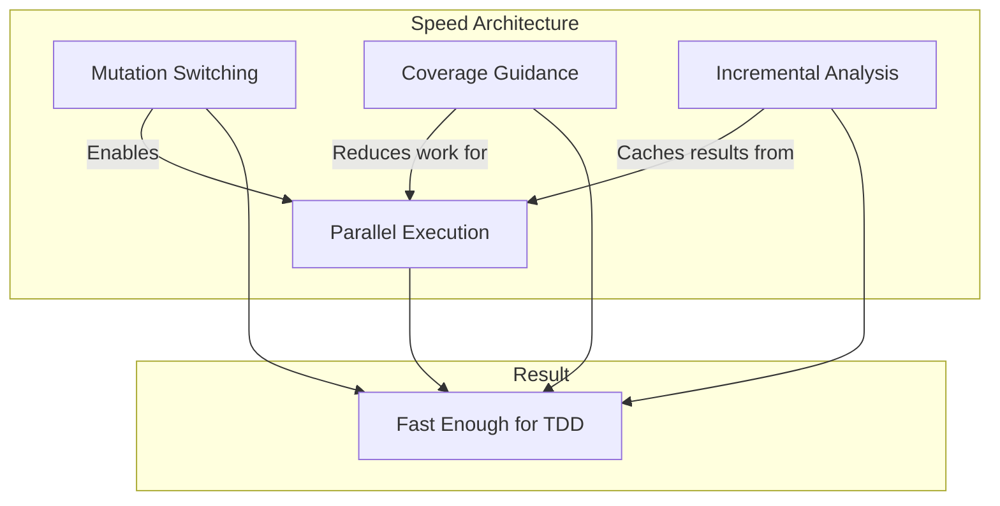
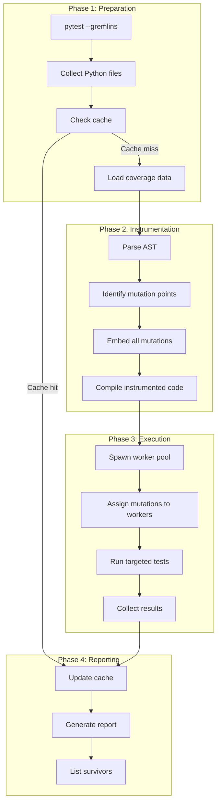

# Architecture Overview

pytest-gremlins is designed from the ground up with one primary goal: **make mutation testing fast enough to use every day**.

Traditional mutation testing tools have a reputation for being slow - painfully slow. A medium-sized project might take hours to analyze, relegating mutation testing to overnight CI runs that developers ignore. pytest-gremlins rejects this compromise.

## Why Speed Matters

Mutation testing is incredibly valuable. It answers the question that line coverage cannot: *Do your tests actually verify anything, or do they just execute code?*

But value without usability is worthless. If mutation testing takes 8 hours:

- Developers won't run it locally
- CI feedback is too slow to act on
- Results become stale before anyone reads them
- The tool becomes shelfware

pytest-gremlins aims for a different experience:

- **Incremental runs in seconds** - Change a file, get feedback immediately
- **Full runs in minutes** - Even on substantial codebases
- **Part of the TDD cycle** - Not a separate "special occasion" tool

## The Four Pillars of Speed

Our speed comes from four architectural decisions that work together:

### 1. Mutation Switching

Instead of modifying files on disk for each mutation, we instrument the code once with all mutations embedded. An environment variable controls which mutation is active.

**Impact:** Eliminates file I/O and module reloads - the slowest parts of traditional mutation testing.

[Learn more about Mutation Switching](mutation-switching.md)

### 2. Coverage-Guided Test Selection

Why run 500 tests against a mutation when only 3 of them can possibly detect it? We use coverage data to run only the tests that actually touch the mutated code.

**Impact:** 10-100x reduction in test executions.

[Learn more about Coverage Guidance](coverage-guidance.md)

### 3. Incremental Analysis

Cache everything. If the source file hasn't changed and the tests haven't changed, the mutation results haven't changed either.

**Impact:** Repeat runs complete in seconds, not minutes.

[Learn more about Incremental Analysis](incremental-analysis.md)

### 4. Parallel Execution

Distribute mutations across multiple worker processes. Mutation switching makes this safe - no file locking, no coordination needed.

**Impact:** Near-linear speedup with available CPU cores.

[Learn more about Parallel Execution](parallelization.md)

## Combined Speedup

These optimizations multiply together:

| Optimization | Individual Gain | Cumulative |
|--------------|-----------------|------------|
| Baseline (naive) | 1x | 1x |
| Mutation switching | 2-5x | 2-5x |
| Coverage guidance | 10-100x | 20-500x |
| Incremental analysis | 10-1000x (repeat runs) | 200-500,000x |
| Parallel (8 cores) | 8x | 1,600-4,000,000x |

A project that would take 8 hours with naive mutation testing can complete in **seconds** on incremental runs with all optimizations active.

## How It All Fits Together

Here is the complete flow from running `pytest --gremlins` to getting your results:

## The Gremlin Theme

We use Gremlins movie references as our domain language:

| Traditional Term | Gremlin Term | Description |
|-----------------|--------------|-------------|
| Original code | **Mogwai** | Clean, untouched source code |
| Start mutation testing | **Feed after midnight** | Begin the mutation process |
| Mutant | **Gremlin** | A mutation injected into code |
| Kill mutant | **Zap** | Test catches the mutation |
| Surviving mutant | **Survivor** | Mutation not caught by tests |

This is not just whimsy. Clear domain language helps communicate concepts and makes documentation more memorable.

## What Makes This Different

Other Python mutation testing tools exist. Here is why we built another one:

| Tool | The Problem |
|------|-------------|
| **mutmut** | Single-threaded, no incremental analysis - 65+ minute runs on medium projects |
| **Cosmic Ray** | Requires Celery + RabbitMQ for parallelization - complex setup |
| **MutPy** | Dead since 2019, only supports Python 3.4-3.7 |
| **mutatest** | Dead since 2022, Python 3.8 only, random sampling behavior |

pytest-gremlins brings the architectural lessons from PIT (Java) and Stryker (JavaScript) to Python:

- **From PIT:** Incremental analysis that reduced 31-hour runs to under 3 minutes
- **From Stryker:** Mutation switching that delivers 20-70% speedup

## Success Metrics

We hold ourselves to concrete performance targets:

1. **Incremental run on unchanged code:** < 5 seconds
2. **Full run on 10K LOC project:** < 5 minutes (8 cores)
3. **Zero config for basic usage:** `pytest --gremlins` just works
4. **No false positives:** Every reported survivor is a real gap in test coverage

## Next Steps

Dive deeper into each pillar:

- [Mutation Switching](mutation-switching.md) - How we eliminate file I/O
- [Coverage Guidance](coverage-guidance.md) - How we reduce test executions by 10-100x
- [Incremental Analysis](incremental-analysis.md) - How caching enables instant feedback
- [Parallel Execution](parallelization.md) - How we scale across CPU cores
- [Speed Deep-Dive](speed.md) - Performance analysis and benchmarks
