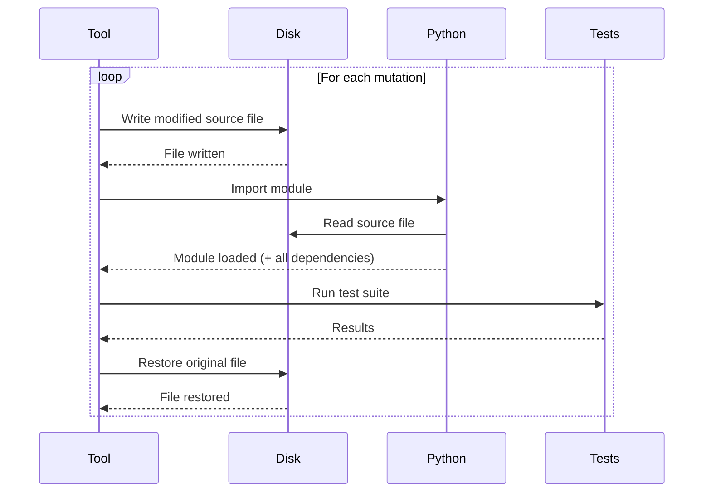
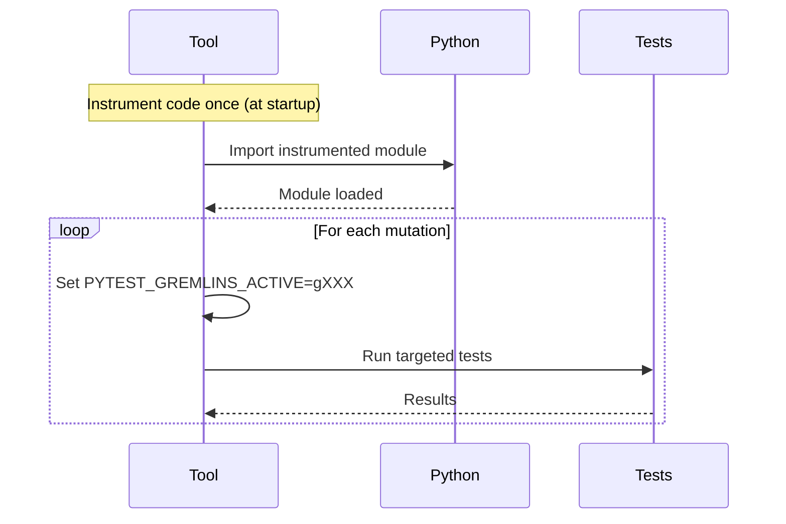
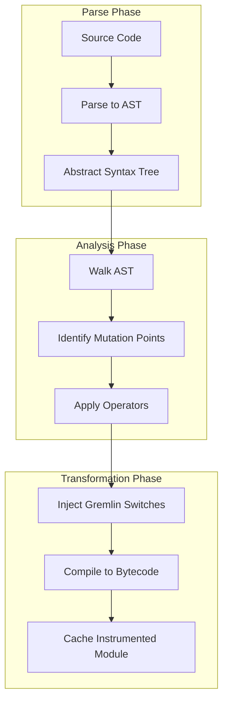

# Mutation Switching

Mutation switching is the foundation of pytest-gremlins' speed architecture. It eliminates
the two slowest operations in traditional mutation testing: file I/O and module reloading.

## The Problem with Traditional Mutation Testing

Traditional mutation testing tools follow this pattern:



For a project with 1,000 mutations, this means:

- 1,000 file writes
- 1,000 file restores
- 1,000 module imports (including transitive dependencies)

In Python, imports are expensive. Loading numpy takes hundreds of milliseconds. Loading a
Django application can take seconds. Multiply that by 1,000 mutations and you understand
why traditional mutation testing takes hours.

## How Mutation Switching Works

Mutation switching takes a fundamentally different approach: instrument the code once with
**all mutations embedded**, then use an environment variable to select which mutation
is active.

### Instrumentation Example

Consider this simple function:

```python
# Original code
def is_adult(age):
    return age >= 18
```

pytest-gremlins instruments it to:

```python
# Instrumented code
import os as __gremlin_os__

def is_adult(age):
    __gremlin_id__ = __gremlin_os__.environ.get('PYTEST_GREMLINS_ACTIVE', '')

    if __gremlin_id__ == 'g001':
        return age > 18    # Mutation: >= to >
    if __gremlin_id__ == 'g002':
        return age <= 18   # Mutation: >= to <=
    if __gremlin_id__ == 'g003':
        return age < 18    # Mutation: >= to <
    if __gremlin_id__ == 'g004':
        return age == 18   # Mutation: >= to ==

    return age >= 18  # Original behavior
```

### Activating Mutations

To test mutation `g001`, we simply set an environment variable:

```bash
PYTEST_GREMLINS_ACTIVE=g001 pytest tests/
```

The instrumented code checks this variable and executes the mutated path. No file modification, no reimporting, no waiting.

### The Flow



The module is loaded exactly once. Each mutation is tested by changing an environment variable - a microsecond operation.

## Why This Is Faster

### No File I/O

Traditional approach:

```text
Write file: ~1-10ms per mutation
Read file (Python import): ~1-5ms per file
Total for 1000 mutations: 2-15 seconds just in file I/O
```

Mutation switching:

```text
No file operations during testing: 0ms
```

### No Module Reloading

Traditional approach:

```text
Import module with dependencies: 50-5000ms per import
1000 mutations: 50 seconds to 83 minutes just importing
```

Mutation switching:

```text
Import once at startup: 50-5000ms total
Environment variable check: <1 microsecond per mutation
```

### Process Stays Hot

Beyond raw import time, there are hidden costs to reloading modules:

- **JIT warmup:** Python's JIT (in 3.13+) loses optimizations
- **Cache invalidation:** Bytecode caches become useless
- **Connection pools:** Database connections get dropped
- **Singleton state:** Application state resets

With mutation switching, the Python process stays warm. Caches remain valid. Connections
stay open. Everything runs at full speed.

## Implementation Details

### The Instrumentation Pipeline



### AST Transformation

The transformer walks the AST looking for patterns that operators can mutate:

```python
class GremlinTransformer(ast.NodeTransformer):
    def visit_Compare(self, node):
        # Find all applicable mutations
        mutations = self.get_mutations(node)

        if not mutations:
            return node

        # Build switch statement
        return self.build_switch(node, mutations)

    def build_switch(self, original, mutations):
        # Returns an if-elif chain that checks __gremlin_id__
        # and returns the appropriate mutated expression
        ...
```

### Generated Code Structure

The generated switch follows a consistent pattern:

```python
# Check which gremlin is active
__gremlin_id__ = __gremlin_os__.environ.get('PYTEST_GREMLINS_ACTIVE', '')

# First mutation
if __gremlin_id__ == 'g001':
    <mutated code>

# Second mutation
if __gremlin_id__ == 'g002':
    <mutated code>

# ... more mutations ...

# Original code (default path)
<original code>
```

The original code is always the default path. When no gremlin is active, the code behaves exactly as written.

### Mutation Identifiers

Each mutation gets a unique identifier:

```text
g_<file_hash>_<line>_<col>_<operator>_<variant>

Example: g_a7b3c_42_8_comparison_gt
```

This identifier:

- Is deterministic (same code = same ID)
- Includes location information for debugging
- Encodes the operator and variant

## Handling Edge Cases

### Module-Level Code

Code that runs at import time poses a challenge:

```python
# This runs during import, before any test
CONFIG = load_config()  # <- Can we mutate this?
```

pytest-gremlins handles this by:

1. Identifying module-level expressions
2. Wrapping them in lazy evaluation where possible
3. Flagging unmutable module-level code in reports

### Class and Function Definitions

Definitions themselves are not mutated (that would require reimporting), but code inside them is:

```python
# The class definition is not mutated
class Calculator:
    # But the method body is
    def add(self, a, b):
        return a + b  # <- This can become a - b
```

### Decorators

Decorated functions work correctly because the switch is inside the function body:

```python
@cache
def expensive_calculation(x):
    __gremlin_id__ = ...
    if __gremlin_id__ == 'g001':
        return x * 2  # Mutated
    return x + 1  # Original
```

The decorator wraps the instrumented function, not the original.

## Debugging Instrumented Code

### Viewing Instrumented Source

```bash
# Show instrumented code for a file
pytest --gremlins --show-instrumented src/mymodule.py
```

### Validating a Specific Mutation

```bash
# Run with a specific mutation active
PYTEST_GREMLINS_ACTIVE=g001 pytest tests/test_specific.py -v
```

### Listing All Mutations

```bash
# List all mutations without running tests
pytest --gremlins --list-gremlins
```

## Comparison with File-Based Mutation

| Aspect | File-Based | Mutation Switching |
|--------|------------|-------------------|
| File I/O per mutation | 2 operations | 0 operations |
| Module imports | N (one per mutation) | 1 (at startup) |
| Process state | Reset each mutation | Preserved |
| Parallelization | Requires file locking | Trivial (env vars) |
| Debugging | Easy (one mutation at a time) | Slightly harder (all embedded) |
| Code readability | Original preserved | Instrumented harder to read |

## Limitations

### Increased Memory Usage

All mutations are in memory at once. For large codebases with many mutations, this can
increase memory usage. In practice, the overhead is modest - a few bytes per mutation point.

### Slightly Larger Bytecode

Instrumented code is larger than original code. This has minimal performance impact but
may affect bytecode cache sizes.

### Compilation Time

Initial instrumentation takes longer than loading uninstrumented code. This is a one-time
cost that pays for itself after a few mutations.

## Inspiration and Prior Art

Mutation switching was pioneered by [Stryker](https://stryker-mutator.io/) for JavaScript. Stryker 4.0 reported:

> "Mutation switching can give a performance boost of up to 20-70%"

For Python, the gains are even larger because:

- Python imports are slower than JavaScript module loading
- Python lacks JavaScript's V8-level JIT optimization
- Many Python projects have heavyweight dependencies (numpy, pandas, Django)

## Summary

Mutation switching is the foundation that makes everything else possible:

- **Speed:** No file I/O, no reimporting
- **Parallelization:** Workers just set different environment variables
- **Simplicity:** No file locking, no temporary directories, no cleanup
- **Stability:** Original files are never modified

Combined with coverage guidance, incremental analysis, and parallel execution, mutation
switching transforms mutation testing from an overnight CI job into a tool you can use
during development.
