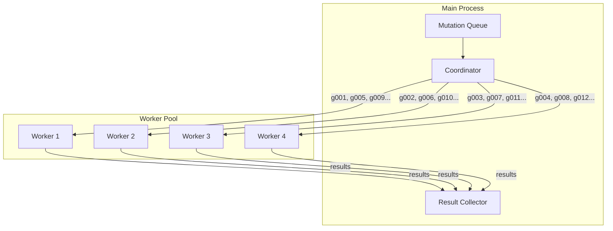
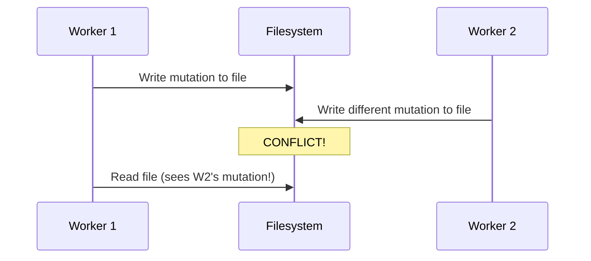
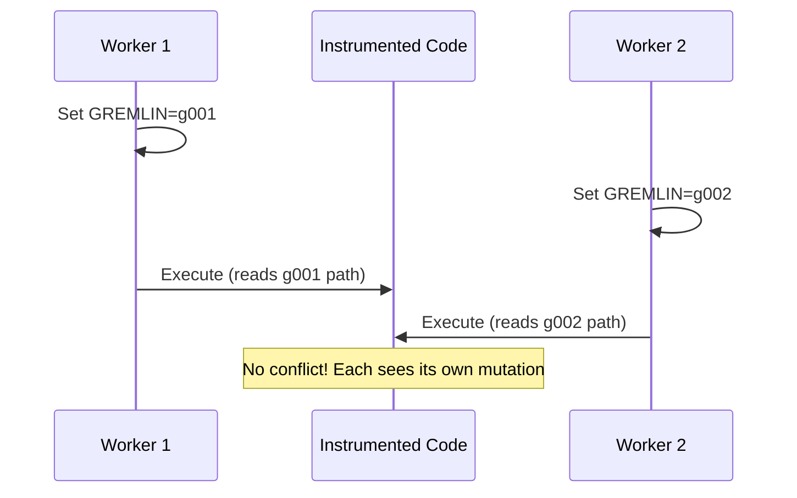

# Parallel Execution

Parallel execution is the fourth pillar of pytest-gremlins' speed architecture. By
distributing mutations across multiple worker processes, we achieve near-linear speedup
with available CPU cores.

## The Problem: Sequential Bottleneck

Even with mutation switching, coverage guidance, and caching, sequential execution has limits:

```text
1,000 mutations x 10ms average per mutation = 10,000ms = 10 seconds
```

That is reasonable. But what about larger projects?

```text
10,000 mutations x 10ms = 100 seconds
100,000 mutations x 10ms = 1,000 seconds = 16+ minutes
```

Modern machines have many CPU cores sitting idle during sequential execution. Parallel execution puts them to work.

## How It Works

pytest-gremlins distributes mutations across a pool of worker processes:



### Worker Assignment

Each worker receives a batch of mutation IDs to test:

```python
# Worker 1 process
import os
os.environ["PYTEST_GREMLINS_ACTIVE"] = "g001"
run_tests(tests_for_g001)

os.environ["PYTEST_GREMLINS_ACTIVE"] = "g005"
run_tests(tests_for_g005)
# ...
```

Workers share the same instrumented code but set different environment variables. This is why
mutation switching is essential - without it, workers would fight over file modifications.

### Result Collection

Results flow back to the main process:

```python
@dataclass
class MutationResult:
    mutation_id: str
    status: Literal["killed", "survived", "timeout", "error"]
    killed_by: str | None
    execution_time_ms: int
    worker_id: int

# Collected from all workers
results: list[MutationResult] = coordinator.collect()
```

## Why Mutation Switching Enables This

Traditional mutation testing cannot parallelize easily:



With mutation switching, there is no conflict:



Each worker:

- Reads the same instrumented code
- Sets its own environment variable
- Executes its own mutation path
- Reports its own results

No locks. No file copies. No coordination needed.

## Implementation Details

### Process Pool

pytest-gremlins uses Python's `ProcessPoolExecutor`:

```python
from concurrent.futures import ProcessPoolExecutor

def test_mutations(mutations: list[Mutation], workers: int) -> list[Result]:
    with ProcessPoolExecutor(max_workers=workers) as pool:
        # Submit batches to workers
        futures = [
            pool.submit(test_mutation_batch, batch)
            for batch in distribute_mutations(mutations, workers)
        ]

        # Collect results
        results = []
        for future in as_completed(futures):
            results.extend(future.result())

    return results
```

### Worker Initialization

Each worker process initializes once:

```python
def worker_init():
    """Called once per worker at startup."""
    # Import the instrumented modules
    import_instrumented_modules()

    # Warm up any caches
    warmup_jit()

    # Ready to test mutations
```

This initialization cost is paid once per worker, not once per mutation.

### Load Balancing

Mutations are distributed using round-robin with adjustments for estimated test time:

```python
def distribute_mutations(mutations: list[Mutation], workers: int) -> list[list[Mutation]]:
    # Sort by estimated test time (from coverage data)
    sorted_mutations = sorted(mutations, key=lambda m: m.estimated_time, reverse=True)

    # Distribute to balance load
    batches = [[] for _ in range(workers)]
    batch_times = [0] * workers

    for mutation in sorted_mutations:
        # Assign to least-loaded worker
        min_idx = batch_times.index(min(batch_times))
        batches[min_idx].append(mutation)
        batch_times[min_idx] += mutation.estimated_time

    return batches
```

This prevents the scenario where one worker gets all the slow mutations while others sit idle.

### Communication

Workers communicate results back to the main process via queues:

```python
from multiprocessing import Queue

result_queue = Queue()

def worker_main(mutations: list[str], result_queue: Queue):
    for mutation_id in mutations:
        result = test_mutation(mutation_id)
        result_queue.put(result)
```

## Configuration

### Number of Workers

```toml
[tool.pytest-gremlins]
# Fixed number of workers
workers = 8

# Or auto-detect based on CPU count
workers = "auto"  # default: cpu_count() - 1
```

Command line override:

```bash
# Explicit worker count
pytest --gremlins --workers 4

# Use all available cores
pytest --gremlins --workers auto
```

### Memory Considerations

Each worker is a separate process with its own memory:

```toml
[tool.pytest-gremlins]
# Limit workers on memory-constrained systems
workers = 4
worker_memory_limit_mb = 512  # Kill worker if exceeded
```

### Worker Timeout

Prevent hung workers:

```toml
[tool.pytest-gremlins]
# Kill mutation if it takes too long
mutation_timeout_seconds = 30

# Kill worker if completely unresponsive
worker_timeout_seconds = 300
```

## Performance Characteristics

### Scaling

Parallel speedup depends on:

| Factor | Impact |
|--------|--------|
| CPU cores | Linear speedup up to core count |
| Mutation count | More mutations = better parallelization efficiency |
| Test duration | Longer tests = more overhead hiding |
| Memory | Workers compete for memory bandwidth |

### Actual vs. Ideal Speedup

```text
Ideal: 8 cores = 8x speedup
Actual: 8 cores = 6-7x speedup
```

The gap comes from:

- Worker startup/shutdown
- Result collection overhead
- Memory bandwidth limits
- Uneven mutation distribution

### When Parallelization Helps Most

| Scenario | Speedup |
|----------|---------|
| Many mutations, slow tests | Near-linear |
| Few mutations, fast tests | Minimal (overhead dominates) |
| Memory-heavy tests | Limited by memory bandwidth |
| I/O-bound tests | Excellent (I/O waits are parallel) |

## Edge Cases

### Worker Crashes

If a worker crashes, its mutations are reassigned:

```python
try:
    result = future.result(timeout=worker_timeout)
except Exception as e:
    log.warning(f"Worker crashed: {e}")
    # Reassign mutations to healthy workers
    requeue_mutations(failed_worker.mutations)
```

### Test Isolation

Tests must be isolated for parallel execution to work:

```python
# GOOD: Isolated test
def test_calculation():
    calc = Calculator()
    assert calc.add(2, 2) == 4

# BAD: Shared state
shared_calc = Calculator()

def test_addition():
    shared_calc.add(2, 2)  # Modifies shared state!
    assert shared_calc.result == 4
```

pytest-gremlins runs each worker with a fresh interpreter, but tests within a worker run
sequentially. Shared state within the test file can cause issues.

### Database Tests

Tests using databases need careful handling:

```python
# Option 1: Separate database per worker
@pytest.fixture
def db():
    db_name = f"test_db_{os.getpid()}"
    return create_database(db_name)

# Option 2: Transaction rollback
@pytest.fixture
def db_session():
    session = create_session()
    yield session
    session.rollback()
```

## pytest-xdist Integration

pytest-gremlins can integrate with pytest-xdist for existing parallel test setups:

```bash
# Use xdist for test parallelization within each gremlin worker
pytest --gremlins --workers 4 -n 2
# 4 gremlin workers, each running 2 test processes
```

This can help when individual tests are slow but parallelizable.

## Monitoring Parallel Execution

### Progress Reporting

```bash
pytest --gremlins --progress
```

Output:

```text
Testing mutations: [=============>      ] 65% (650/1000)
  Worker 1: g0834 (tests/test_auth.py::test_login)
  Worker 2: g0835 (tests/test_shipping.py::test_rate)
  Worker 3: g0836 (tests/test_utils.py::test_parse)
  Worker 4: idle (waiting for work)

Completed: 650 | Killed: 580 | Survived: 60 | Errors: 10
ETA: 45 seconds
```

### Worker Statistics

```bash
pytest --gremlins --worker-stats
```

Output:

```text
Worker Statistics:
  Worker 1: 175 mutations, 89% killed, avg 12ms
  Worker 2: 170 mutations, 91% killed, avg 15ms
  Worker 3: 168 mutations, 87% killed, avg 11ms
  Worker 4: 162 mutations, 88% killed, avg 14ms

Load balance: 95% (good)
Total wall time: 48 seconds
Total CPU time: 185 seconds
Parallelization efficiency: 96%
```

## Debugging Parallel Issues

### Single Worker Mode

When debugging, disable parallelization:

```bash
pytest --gremlins --workers 1
```

### Verbose Worker Output

```bash
pytest --gremlins --worker-verbose
```

Shows each worker's activity in real-time.

### Reproduce Specific Mutation

```bash
# Run just one mutation in the main process
PYTEST_GREMLINS_ACTIVE=g0834 pytest tests/test_auth.py -v
```

## Trade-offs

### Memory Usage

Each worker uses memory independently:

```text
8 workers x 200MB per worker = 1.6GB total
```

On memory-constrained systems, reduce worker count.

### Startup Overhead

Workers take time to start and import modules:

```text
Worker startup: ~500ms each
For 8 workers: ~500ms (parallel startup)
```

This overhead is amortized across all mutations. For small projects (< 100 mutations), it might not be worth it.

### Complexity

Parallel systems are harder to debug. When something goes wrong:

1. Try single-worker mode first
2. Check for test isolation issues
3. Look for shared state problems
4. Review worker logs

## Summary

Parallel execution provides near-linear speedup with CPU cores:

1. **Distribute mutations** across worker processes
2. **Mutation switching enables safety** - no file locking needed
3. **Collect results** efficiently via queues
4. **Balance load** based on estimated test times

Combined with mutation switching, coverage guidance, and incremental analysis, parallel
execution makes mutation testing practical even for large codebases.

The result: 8 cores means roughly 8x faster analysis. A 16-minute sequential run becomes 2 minutes.
