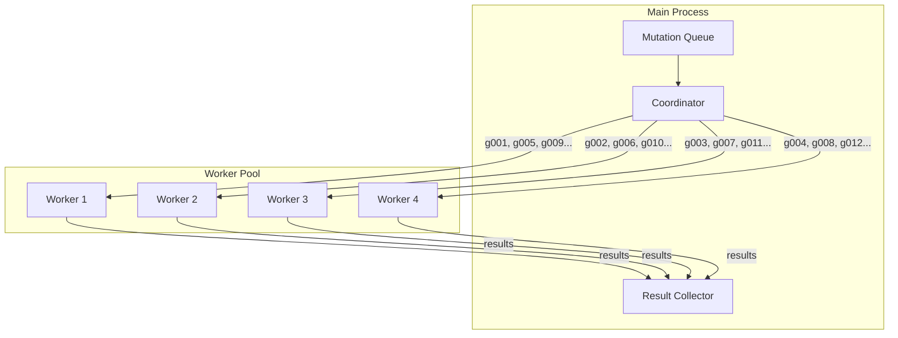
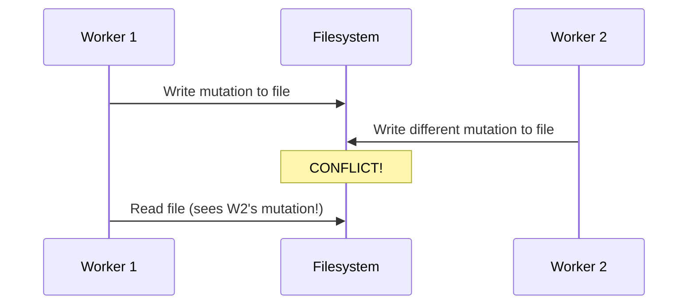
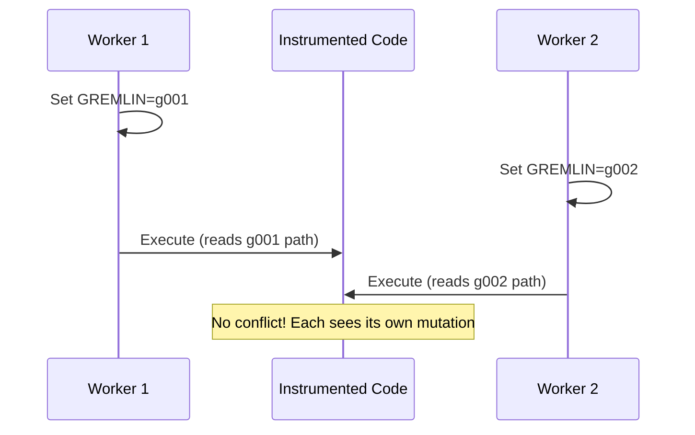

# Parallel Execution

Parallel execution is the fourth pillar of pytest-gremlins' speed architecture. By
distributing mutations across multiple worker processes, we achieve near-linear speedup
with available CPU cores.

## The Problem: Sequential Bottleneck

Even with mutation switching, coverage guidance, and caching, sequential execution has limits:

```text
1,000 mutations x 10ms average per mutation = 10,000ms = 10 seconds
```

That is reasonable. But what about larger projects?

```text
10,000 mutations x 10ms = 100 seconds
100,000 mutations x 10ms = 1,000 seconds = 16+ minutes
```

Modern machines have many CPU cores sitting idle during sequential execution. Parallel execution puts them to work.

## How It Works

pytest-gremlins distributes mutations across a pool of worker processes:


```mermaid
graph TB
    subgraph "Main Process"
        QUEUE["Mutation Queue"]
        COORD["Coordinator"]
        RESULTS["Result Collector"]
    end

    subgraph "Worker Pool"
        W1["Worker 1"]
        W2["Worker 2"]
        W3["Worker 3"]
        W4["Worker 4"]
    end

    QUEUE --> COORD
    COORD -->|"g001, g005, g009..."| W1
    COORD -->|"g002, g006, g010..."| W2
    COORD -->|"g003, g007, g011..."| W3
    COORD -->|"g004, g008, g012..."| W4

    W1 -->|"results"| RESULTS
    W2 -->|"results"| RESULTS
    W3 -->|"results"| RESULTS
    W4 -->|"results"| RESULTS
```

### Worker Assignment

Each worker receives a batch of mutation IDs to test:

```python
# Worker 1 process
import os
os.environ["ACTIVE_GREMLIN"] = "g001"
run_tests(tests_for_g001)

os.environ["ACTIVE_GREMLIN"] = "g005"
run_tests(tests_for_g005)
# ...
```

Workers share the same instrumented code but set different environment variables. This is why
mutation switching is essential - without it, workers would fight over file modifications.

### Result Collection

Results flow back to the main process:

```python
@dataclass
class MutationResult:
    mutation_id: str
    status: Literal["killed", "survived", "timeout", "error"]
    killed_by: str | None
    execution_time_ms: int
    worker_id: int

# Collected from all workers
results: list[MutationResult] = coordinator.collect()
```

## Why Mutation Switching Enables This

Traditional mutation testing cannot parallelize easily:


```mermaid
sequenceDiagram
    participant W1 as Worker 1
    participant FS as Filesystem
    participant W2 as Worker 2

    W1->>FS: Write mutation to file
    W2->>FS: Write different mutation to file
    Note over FS: CONFLICT!
    W1->>FS: Read file (sees W2's mutation!)
```

With mutation switching, there is no conflict:


```mermaid
sequenceDiagram
    participant W1 as Worker 1
    participant CODE as Instrumented Code
    participant W2 as Worker 2

    W1->>W1: Set GREMLIN=g001
    W2->>W2: Set GREMLIN=g002
    W1->>CODE: Execute (reads g001 path)
    W2->>CODE: Execute (reads g002 path)
    Note over CODE: No conflict! Each sees its own mutation
```

Each worker:

- Reads the same instrumented code
- Sets its own environment variable
- Executes its own mutation path
- Reports its own results

No locks. No file copies. No coordination needed.

## Implementation Details

### Process Pool

pytest-gremlins uses Python's `ProcessPoolExecutor`:

```python
from concurrent.futures import ProcessPoolExecutor

def test_mutations(mutations: list[Mutation], workers: int) -> list[Result]:
    with ProcessPoolExecutor(max_workers=workers) as pool:
        # Submit batches to workers
        futures = [
            pool.submit(test_mutation_batch, batch)
            for batch in distribute_mutations(mutations, workers)
        ]

        # Collect results
        results = []
        for future in as_completed(futures):
            results.extend(future.result())

    return results
```

### Worker Initialization

Each worker process initializes once:

```python
def worker_init():
    """Called once per worker at startup."""
    # Import the instrumented modules
    import_instrumented_modules()

    # Warm up any caches
    warmup_jit()

    # Ready to test mutations
```

This initialization cost is paid once per worker, not once per mutation.

### Load Balancing

Mutations are distributed using round-robin with adjustments for estimated test time:

```python
def distribute_mutations(mutations: list[Mutation], workers: int) -> list[list[Mutation]]:
    # Sort by estimated test time (from coverage data)
    sorted_mutations = sorted(mutations, key=lambda m: m.estimated_time, reverse=True)

    # Distribute to balance load
    batches = [[] for _ in range(workers)]
    batch_times = [0] * workers

    for mutation in sorted_mutations:
        # Assign to least-loaded worker
        min_idx = batch_times.index(min(batch_times))
        batches[min_idx].append(mutation)
        batch_times[min_idx] += mutation.estimated_time

    return batches
```

This prevents the scenario where one worker gets all the slow mutations while others sit idle.

### Communication

Workers communicate results back to the main process via queues:

```python
from multiprocessing import Queue

result_queue = Queue()

def worker_main(mutations: list[str], result_queue: Queue):
    for mutation_id in mutations:
        result = test_mutation(mutation_id)
        result_queue.put(result)
```

## The Lightweight Runner Is Disabled

Every gremlin runs its tests through the real pytest bootstrap. Earlier releases routed
gremlins to a lightweight runner that imported the test module and called the test function
directly, without starting pytest. That is only faithful for a test that needs nothing from
pytest, and it fabricated verdicts for async, parametrized and fixture-taking tests, for tests
that depend on `conftest.py` imports or `pytest_configure` hooks, and for tests that import
helpers from pytest's `sys.path` (the test file's directory or an ini `pythonpath`). Gating
which tests it may judge kept leaking cases, so it is off in 1.9.1 and the redesign is tracked in
[#538](https://github.com/mikelane/pytest-gremlins/issues/538). Plain suites are slower as a
result (roughly 5x in one measurement), in exchange for verdicts that come from pytest itself.

The eligibility predicate (`is_lightweight_safe`), the runner script generator and the
`70` "cannot verify" exit code are kept, unused, as groundwork for that redesign.

### Fork and in-process executors are disabled

`--gremlin-executor=fork` and `--gremlin-executor=inprocess` fail at startup with a usage error
(exit code 4) that names the value you passed and points to `--gremlin-executor=subprocess`, the
default. They toggled a flag in the pytest process, whose modules are never instrumented, so they
did not run the mutated code and could report every gremlin as a survivor. The redesign is
tracked in [#532](https://github.com/mikelane/pytest-gremlins/issues/532). The `ForkExecutor` and
`InProcessExecutor` classes remain in the code base for that work but are not reachable from the
command line.

### Cached results

The incremental cache key includes a runner fidelity version (`rf9`), so verdicts cached by
v1.9.0 or by interim builds, which used the lightweight runner, are recomputed once after upgrading.
So are timeouts cached before they were confirmed against the unmutated tests (#565).
So are verdicts cached while instrumented modules had no `__file__` (#525), when target code that read it
failed under every gremlin.
So are verdicts cached for gremlins in a package `__init__.py` (#591), which were never activated and so
were all cached as SURVIVED.
So are verdicts cached while instrumented files were registered under a module name guessed from
`sys.path` and `pythonpath` (#597), which could differ from the name the tests import them under, so
the instrumented code never loaded and every gremlin was cached as SURVIVED.
Gremlins whose mutant stopped the suite from loading (a conftest import error, a test module that
failed to collect, or a changed parametrize id) are recorded as ZAPPED with the killing test
`<collection>`; ones cached as ERROR before that change are recomputed too.

Verdicts are not cached in three cases, so fixing the cause never replays stale errors from a warm cache:

- while load failures are unattributable (the unmutated suite cannot load in the gremlin subprocess)
- after a kill is downgraded to ERROR because the gremlin's own unmutated selection fails to load
- after a timeout is downgraded to ERROR because the unmutated selection takes more than half the
  limit, or times out

## Configuration

### Number of Workers

Use `--gremlin-parallel` to enable parallel mode. Pass `--gremlin-workers=N` to pin the worker count (implies `--gremlin-parallel`):

```bash
pytest --gremlins --gremlin-parallel        # use all CPU cores
pytest --gremlins --gremlin-workers=4       # use 4 workers
```

### Worker Timeout

Each mutation subprocess has a 30-second timeout. Mutations that exceed it are
reported as `TIMEOUT` rather than `SURVIVED` or `ERROR`.

## Performance Characteristics

### Scaling

Parallel speedup depends on:

| Factor | Impact |
|--------|--------|
| CPU cores | Linear speedup up to core count |
| Mutation count | More mutations = better parallelization efficiency |
| Test duration | Longer tests = more overhead hiding |
| Memory | Workers compete for memory bandwidth |

### Actual vs. Ideal Speedup

```text
Ideal: 8 cores = 8x speedup
Actual: 8 cores = 6-7x speedup
```

The gap comes from:

- Worker startup/shutdown
- Result collection overhead
- Memory bandwidth limits
- Uneven mutation distribution

### When Parallelization Helps Most

| Scenario | Speedup |
|----------|---------|
| Many mutations, slow tests | Near-linear |
| Few mutations, fast tests | Minimal (overhead dominates) |
| Memory-heavy tests | Limited by memory bandwidth |
| I/O-bound tests | Excellent (I/O waits are parallel) |

## Edge Cases

### Worker Crashes

If a worker crashes, its mutations are reassigned:

```python
try:
    result = future.result(timeout=worker_timeout)
except Exception as e:
    log.warning(f"Worker crashed: {e}")
    # Reassign mutations to healthy workers
    requeue_mutations(failed_worker.mutations)
```

### Test Isolation

Tests must be isolated for parallel execution to work:

```python
# GOOD: Isolated test
def test_calculation():
    calc = Calculator()
    assert calc.add(2, 2) == 4

# BAD: Shared state
shared_calc = Calculator()

def test_addition():
    shared_calc.add(2, 2)  # Modifies shared state!
    assert shared_calc.result == 4
```

pytest-gremlins runs each worker with a fresh interpreter, but tests within a worker run
sequentially. Shared state within the test file can cause issues.

### Database Tests

Tests using databases need careful handling:

```python
# Option 1: Separate database per worker
@pytest.fixture
def db():
    db_name = f"test_db_{os.getpid()}"
    return create_database(db_name)

# Option 2: Transaction rollback
@pytest.fixture
def db_session():
    session = create_session()
    yield session
    session.rollback()
```

## pytest-xdist Integration (v1.5.0+)

Since v1.5.0, `--gremlins` and `-n` work together via a two-phase model:

**Phase 1 -- Test Distribution.** xdist distributes the test suite across workers using its
normal `-n auto` scheduling. This phase collects coverage data and builds the test-to-line
mapping that drives gremlin evaluation.

**Phase 2 -- Mutation Evaluation.** pytest-gremlins reads xdist's resolved worker count
and uses it for parallel mutation evaluation. Each worker sets its own
`ACTIVE_GREMLIN` environment variable, so mutations never interfere.

The practical upside: `-n auto` is all you need for both test distribution and mutation
parallelism.

```bash
pytest --gremlins -n auto        # recommended
pytest --gremlins -n 4           # explicit worker count
```

### Standalone Worker Pool

If you want parallel mutations *without* xdist test distribution, the built-in worker
pool is still available:

```bash
pytest --gremlins --gremlin-parallel       # all CPU cores
pytest --gremlins --gremlin-workers=4      # explicit count
```

### Running Without xdist

When pytest-xdist is not installed, pytest-gremlins operates in single-worker mode
automatically. No error is raised.

## Monitoring Parallel Execution

pytest-gremlins logs progress to the console as workers complete mutations.
For detailed results, generate an HTML report:

```bash
pytest --gremlins --gremlin-parallel --gremlin-report=html
```

<!-- TODO: verify whether --progress and --worker-stats flags are planned -->

## Debugging Parallel Issues

### Single Worker Mode

When debugging, run with a single worker to get sequential output:

```bash
pytest --gremlins --gremlin-workers=1
```

### Reproduce Specific Mutation

```bash
# Run just one mutation in the main process
ACTIVE_GREMLIN=g0834 pytest tests/test_auth.py -v
```

## Trade-offs

### Memory Usage

Each worker uses memory independently:

```text
8 workers x 200MB per worker = 1.6GB total
```

On memory-constrained systems, reduce worker count.

### Startup Overhead

Workers take time to start and import modules:

```text
Worker startup: ~500ms each
For 8 workers: ~500ms (parallel startup)
```

This overhead is amortized across all mutations. For small projects (< 100 mutations), it might not be worth it.

### Complexity

Parallel systems are harder to debug. When something goes wrong:

1. Try single-worker mode first
2. Check for test isolation issues
3. Look for shared state problems
4. Review worker logs

## Summary

Parallel execution provides near-linear speedup with CPU cores:

1. **Distribute mutations** across worker processes
2. **Mutation switching enables safety** - no file locking needed
3. **Collect results** efficiently via queues
4. **Balance load** based on estimated test times

Combined with mutation switching, coverage guidance, and incremental analysis, parallel
execution makes mutation testing practical even for large codebases.

The result: 8 cores means roughly 8x faster analysis. A 16-minute sequential run becomes 2 minutes.
