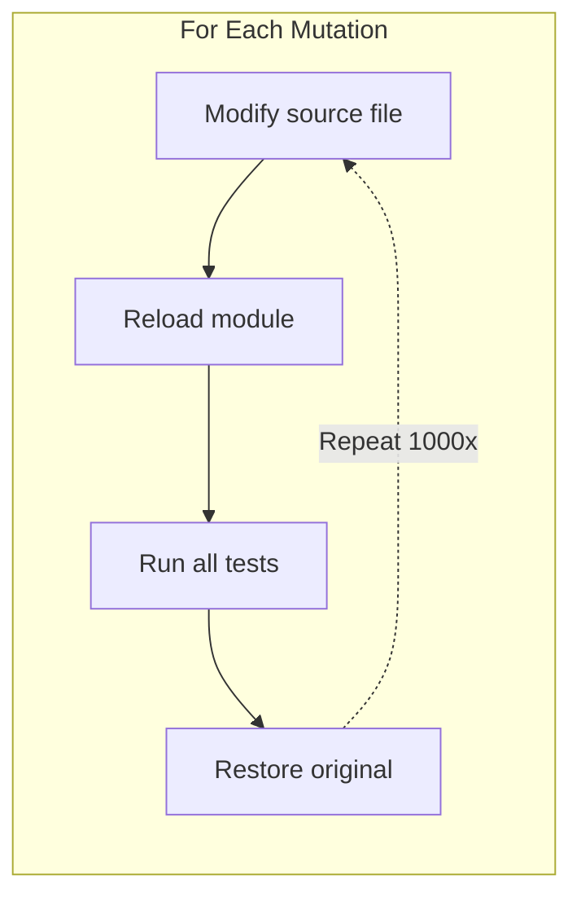
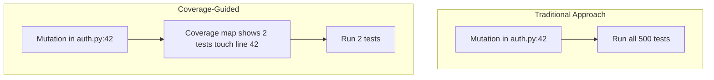
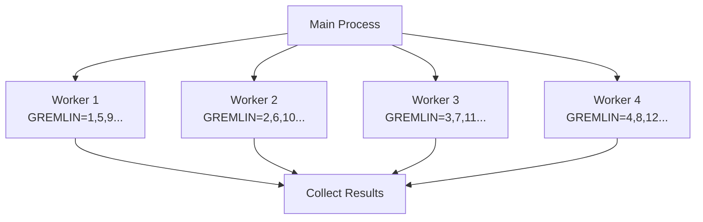
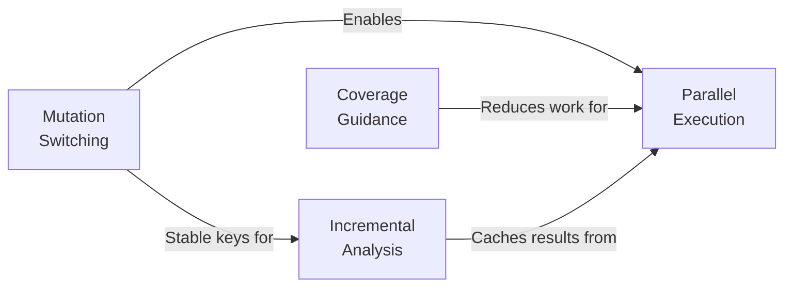

# The Four Pillars of Speed

pytest-gremlins achieves its performance through four complementary architectural decisions.
Each pillar addresses a different bottleneck in traditional mutation testing. Together, they
make mutation testing practical for everyday development.

## Understanding the Baseline Problem

Traditional mutation testing works like this:



For a project with 1,000 mutation points and 500 tests:

- 1,000 file modifications
- 1,000 module reloads (including transitive imports)
- 500,000 test executions
- 1,000 file restorations

No wonder it takes hours.

## Pillar 1: Mutation Switching

**Problem solved:** File I/O and module reloads are slow.

**Solution:** Instrument the code once with all mutations embedded. An environment variable
selects which mutation is active at runtime.

```python
# Original code
def is_adult(age):
    return age >= 18

# Instrumented code (simplified)
def is_adult(age):
    _g = __gremlin_active__
    if _g == "g001": return age > 18   # >= to >
    if _g == "g002": return age <= 18  # >= to <=
    if _g == "g003": return age < 18   # >= to <
    return age >= 18  # original
```

**Why it is faster:**

- Zero file I/O during test execution
- Zero module reloads between mutations
- Single AST parse per file
- Test process stays "hot" (cached imports, JIT-compiled code)

**Expected speedup:** 2-5x compared to file-modification approaches

[Full details: Mutation Switching Deep-Dive](mutation-switching.md)

## Pillar 2: Coverage-Guided Test Selection

**Problem solved:** Most test-mutation combinations are pointless.

**Solution:** Use coverage data to identify which tests can actually detect each mutation. Only run those tests.



**The math:**

- 1,000 mutations x 500 tests = 500,000 test runs (naive)
- With coverage guidance: 1,000 mutations x 5 average tests = 5,000 test runs
- **100x reduction**

**Why it works:**

- A test that never executes line 42 cannot possibly detect a mutation on line 42
- Well-modularized code has focused test coverage
- Integration tests might touch many lines, but unit tests are targeted

**Expected speedup:** 10-100x depending on codebase modularity

[Full details: Coverage Guidance Deep-Dive](coverage-guidance.md)

## Pillar 3: Incremental Analysis

**Problem solved:** Re-analyzing unchanged code is wasteful.

**Solution:** Cache results keyed by content hashes. Only re-run analysis when something
actually changes.

```python
cache_key = hash(
    source_file_content +
    test_file_content +
    mutation_definition
)

if cache_key in history:
    return history[cache_key]  # Instant
else:
    result = run_tests()
    history[cache_key] = result
    return result
```

**Cache invalidation rules:**

| What Changed | What Gets Re-analyzed |
|--------------|----------------------|
| Source file modified | Mutations in that file |
| Test file modified | Mutations covered by those tests |
| New test added | Mutations the new test covers |
| Test deleted | Mutations that test was zapping |
| Nothing changed | Return cached results instantly |

**Why it works:**

- Most development changes are localized
- Tests change less frequently than implementation
- Content hashing catches actual changes, not just timestamps

**Expected speedup:** 10-1000x on repeat runs

[Full details: Incremental Analysis Deep-Dive](incremental-analysis.md)

## Pillar 4: Parallel Execution

**Problem solved:** Even with optimizations, sequential execution is slow.

**Solution:** Distribute mutations across worker processes. Mutation switching makes this safe.



**Why mutation switching enables this:**

- Traditional approach: Workers compete for file locks
- Mutation switching: All workers read the same instrumented code
- Each worker just sets a different environment variable
- No locks, no coordination, no shared mutable state

**Why it works:**

- Modern machines have many cores
- Mutation testing is embarrassingly parallel
- Each mutation is completely independent

**Expected speedup:** Near-linear with core count (8 cores = roughly 8x faster)

[Full details: Parallel Execution Deep-Dive](parallelization.md)

## How the Pillars Work Together

These are not independent optimizations - they enable and amplify each other:



**Mutation Switching enables Parallel Execution:**
Without mutation switching, parallel workers would need file locking or isolated file copies.
With mutation switching, parallelization is trivial.

**Coverage Guidance reduces work for Parallel Execution:**
With fewer test runs per mutation, workers complete faster and the overall throughput
increases.

**Incremental Analysis caches results from Parallel Execution:**
Results from parallel workers are cached together, so the next run benefits regardless of
which worker produced the result.

**Mutation Switching provides stable keys for Incremental Analysis:**
Because mutations are embedded at instrumentation time, they have stable identifiers that
work well as cache keys.

## Cumulative Speedup Analysis

Starting from a baseline of naive mutation testing:

| Optimization | This Pillar | Cumulative |
|--------------|-------------|------------|
| Baseline | 1x | 1x |
| Mutation switching | 2-5x | 2-5x |
| Coverage guidance | 10-100x | 20-500x |
| Incremental (repeat) | 10-1000x | 200-500,000x |
| Parallel (8 cores) | 8x | 1,600-4,000,000x |

**Real-world example:**

A project with:

- 10,000 lines of code
- 1,000 mutation points
- 500 tests
- 8 CPU cores

| Approach | Time |
|----------|------|
| Naive (mutmut-style) | ~8 hours |
| Mutation switching only | ~2 hours |
| + Coverage guidance | ~2-10 minutes |
| + Parallel execution | ~15-75 seconds |
| Incremental (repeat run) | ~5 seconds |

## Benchmark Comparisons

> **Note: Benchmarks Coming**
>
> We are building a benchmark suite to provide concrete performance comparisons.
> The numbers above are projections based on:
>
> - PIT's documented 10-100x speedup from incremental analysis
> - Stryker's documented 20-70% speedup from mutation switching
> - Standard parallel execution scaling
>
> Real benchmarks will be published as the implementation matures.

## Performance Tuning

Each pillar has configuration options for tuning performance:

### Mutation Switching

No tuning needed - it is always faster than file modification.

### Coverage Guidance

```toml
[tool.pytest-gremlins]
# Minimum test execution threshold before coverage guidance kicks in
coverage_guidance_threshold = 10
```

### Incremental Analysis

```toml
[tool.pytest-gremlins]
# Cache location (default: .gremlins_cache)
cache_dir = ".gremlins_cache"

# Clear cache for fresh analysis
# pytest --gremlins --clear-cache
```

### Parallel Execution

```toml
[tool.pytest-gremlins]
# Number of worker processes (default: CPU count)
workers = 8

# Or use 'auto' to let pytest-gremlins decide
workers = "auto"
```

## When Speed Still Is Not Enough

Even with all optimizations, some scenarios are challenging:

**Slow tests:** If individual tests take seconds, mutation testing will be slow. Consider
test optimization or running gremlins only against fast tests.

**Massive mutation counts:** Some files generate thousands of mutations. Consider focusing
on critical paths or using mutation sampling.

**Import-heavy codebases:** Heavy imports (numpy, pandas, torch) slow down worker startup.
This is mitigated by worker pooling but not eliminated.

## Summary

Speed is not a feature - it is a requirement. pytest-gremlins achieves practical mutation testing speeds through:

1. **Mutation Switching** - No file I/O, no reloads
2. **Coverage Guidance** - 10-100x fewer test runs
3. **Incremental Analysis** - Instant repeat runs
4. **Parallel Execution** - Scale with available cores

These pillars work together to transform mutation testing from an overnight CI job into a tool you can use during development.
